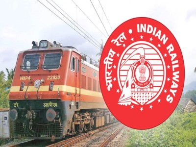

## Indian Railways Announcement System

A project to demonstrate how we can generate the Railways Station Announcement by maintaining a database of required information regarding the trains in an excel sheet.
What actually done in this project is that, 
* First of all we had to record the sample announcement of any of the train from the railway station, 
* Or we can also download the sample announcement from the internet. 
* And then trimming the recorded sound of the train no., train name, source & destination, platform on which train is arriving, and so on.
* Maintain a database in excel sheet of various information regarding the train no., name, source destination, platform no. on which train is arriving and so on.
* And finally merged the generated voice with that trimmed audio file according to our database.

### Here we have some sample announcement generated by this project, lets check it out
<audio src="announcement_1 2 3 9 3_1.mp3" controls="controls"></audio>

<audio src="announcement_1 4 3 1 6_2.mp3" controls="controls"></audio>
